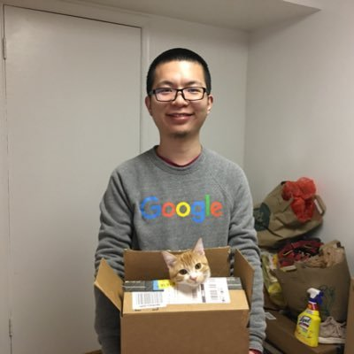
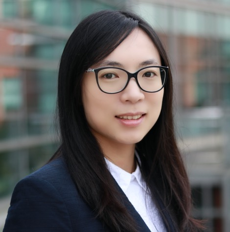
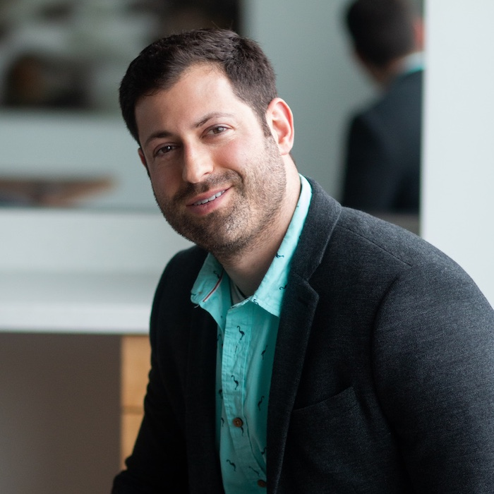

# Organizers

||||
|[Xinyun Chen](https://jungyhuk.github.io/) UC Berkeley|[Cihang Xie](https://cihangxie.github.io/) UC Santa Cruz|[Ali Shafahi](https://www.cs.umd.edu/~ashafahi/) University of Maryland|
|||||
|[Bo Li](https://aisecure.github.io/) UIUC|[Ding Zhao](https://safeai-lab.github.io/) Carnegie Mellon University|[Tom Goldstein](https://www.cs.umd.edu/~tomg/) University of Maryland|[Dawn Song](https://people.eecs.berkeley.edu/~dawnsong/tom) UC Berkeley|

# Workflow Co-organizers

|||
[Fan Wu](https://kkkkahlua.github.io/) UIUC|[Boxin Wang](https://wbx.life/) UIUC|[Mansur Arief](https://www.linkedin.com/in/mansurarief/) Carnegie Mellon University|
